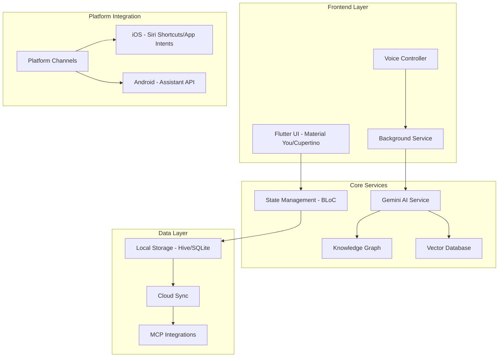

# Life OS Flutter - Architecture Document

## 🎯 Vision
Create a cross-platform AI assistant that replaces Siri/Google Assistant, providing a unified experience for capturing, organizing, and reasoning across all life data.

## 🏗️ System Architecture



## 📱 Platform-Specific Features

### iOS Integration
- **Siri Shortcuts**: Deep integration with iOS Shortcuts app
- **App Intents**: iOS 16+ App Intents framework for system-level integration
- **Live Activities**: Real-time status updates on Dynamic Island
- **Focus Filters**: Integration with iOS Focus modes
- **ScreenTime API**: Usage insights and productivity metrics

### Android Integration
- **Assistant API**: Replace Google Assistant as default
- **Accessibility Service**: System-wide data capture
- **Work Profile**: Separate personal/work contexts
- **Direct Share**: Quick capture from any app
- **Bubbles API**: Floating assistant interface

## 🛠️ Technical Stack

### Core Technologies
- **Flutter 3.16+**: Cross-platform framework
- **Dart 3.0+**: Null-safe, modern language features
- **BLoC Pattern**: Predictable state management
- **GetIt + Injectable**: Dependency injection

### AI & Processing
- **Google Generative AI**: Gemini 2.0 Flash for multimodal processing
- **On-device ML**: TensorFlow Lite for privacy-sensitive operations
- **Vector Database**: ObjectBox for semantic search
- **Knowledge Graph**: Custom graph implementation

### Background Processing
- **flutter_background_service**: Cross-platform background execution
- **Isolates**: Heavy processing without blocking UI
- **Platform Channels**: Native code integration

## 🏃‍♂️ Implementation Phases

### Phase 1: Foundation (Weeks 1-4)
- [x] Project setup with Flutter
- [ ] Core architecture implementation
- [ ] Basic UI with Material You/Cupertino
- [ ] Voice capture and transcription
- [ ] Local storage setup

### Phase 2: AI Integration (Weeks 5-8)
- [ ] Gemini AI integration
- [ ] Multimodal processing pipeline
- [ ] Knowledge graph implementation
- [ ] Vector database for semantic search
- [ ] Context-aware responses

### Phase 3: Platform Integration (Weeks 9-12)
- [ ] iOS Siri Shortcuts integration
- [ ] Android Assistant API integration
- [ ] Background service implementation
- [ ] System-wide capture mechanisms
- [ ] Platform-specific optimizations

### Phase 4: Advanced Features (Weeks 13-16)
- [ ] MCP protocol implementation
- [ ] Third-party integrations (Notion, Gmail, etc.)
- [ ] Advanced reasoning capabilities
- [ ] Proactive suggestions
- [ ] Cross-device sync

### Phase 5: Polish & Launch (Weeks 17-20)
- [ ] Performance optimization
- [ ] Security hardening
- [ ] Beta testing program
- [ ] App Store/Play Store submission
- [ ] Launch marketing

## 🔧 Key Components

### 1. Voice Assistant Service
```dart
class VoiceAssistantService {
  // Continuous listening in background
  // Wake word detection
  // Multi-language support
  // Noise cancellation
}
```

### 2. Multimodal Processor
```dart
class MultimodalProcessor {
  // Text, audio, image, video processing
  // Context extraction
  // Entity recognition
  // Relationship mapping
}
```

### 3. Knowledge Graph
```dart
class KnowledgeGraph {
  // Entity relationships
  // Temporal connections
  // Context clustering
  // Semantic search
}
```

### 4. Platform Bridge
```dart
class PlatformBridge {
  // iOS: Siri Shortcuts, App Intents
  // Android: Assistant API, Accessibility
  // Unified interface
}
```

## 🔐 Security & Privacy

### Data Protection
- **End-to-end encryption** for sensitive data
- **On-device processing** when possible
- **Differential privacy** for analytics
- **Secure enclave** usage on iOS
- **Android Keystore** for credentials

### Privacy Features
- **Data minimization**: Only collect necessary data
- **User control**: Easy data export/deletion
- **Transparency**: Clear data usage policies
- **Local-first**: Minimize cloud dependencies

## 📊 Performance Targets

- **Voice response time**: < 500ms
- **Background battery usage**: < 5% daily
- **Memory footprint**: < 150MB active
- **Offline capability**: 80% features available
- **Cross-platform parity**: 95% feature consistency

## 🚀 Deployment Strategy

### Beta Testing
1. **TestFlight** (iOS): 10,000 testers
2. **Play Console** (Android): Open beta
3. **Firebase App Distribution**: Internal testing

### App Store Optimization
- **Keywords**: AI assistant, productivity, voice notes
- **Screenshots**: Platform-specific UI showcases
- **App Preview**: Voice interaction demo
- **Ratings prompt**: Smart timing algorithm

### Marketing Approach
- **Product Hunt** launch
- **Tech influencer** partnerships
- **Productivity community** engagement
- **Free tier** with premium features

## 🔄 Future Roadmap

### Version 2.0
- **Apple Intelligence** integration (iOS 18+)
- **Gemini Nano** on-device model
- **AR/VR** support for Vision Pro
- **Wearable** companion apps

### Version 3.0
- **Autonomous agents** for task completion
- **Multi-user** collaboration
- **Enterprise** features
- **API platform** for developers

## 📝 Development Guidelines

### Code Organization
```
lib/
├── core/           # Core business logic
├── features/       # Feature modules
├── shared/         # Shared components
└── main.dart       # Entry point
```

### Testing Strategy
- **Unit tests**: 80% coverage minimum
- **Widget tests**: All UI components
- **Integration tests**: Critical user flows
- **Golden tests**: Visual regression

### CI/CD Pipeline
- **GitHub Actions**: Automated builds
- **Fastlane**: Deployment automation
- **Codemagic**: iOS signing management
- **Firebase**: Crash reporting & analytics 